 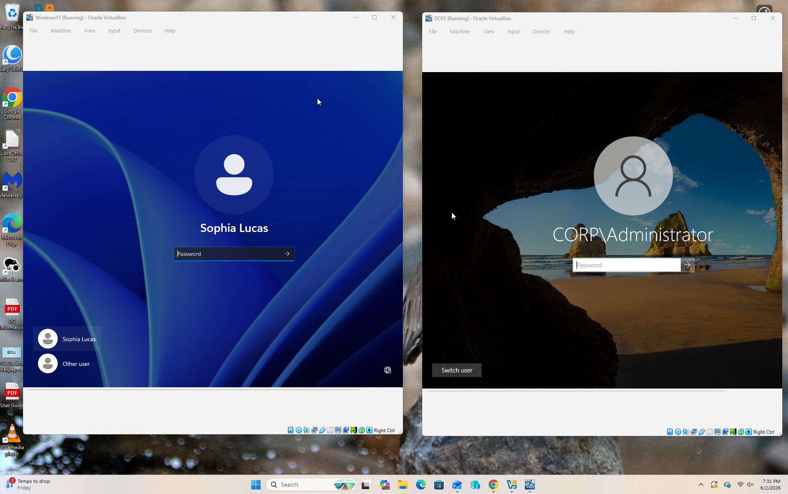 

# Active-Directory-User-Management-Lab
# Overview
Built a Windows Server 2022 Active Directory home lab using VirtualBox to simulate a corporate IT environment. Configured Active Directory Domain Services (AD DS), DNS, Organizational Units (OUs), users, security groups, shared folders, and access permissions. Joined a Windows 11 workstation to the domain and verified user access to network resources.

# Skills Demonstrated
- Active Directory Administration
- Identity and Access Management (IAM)
- File Sahre Management
- Access permission Management
- User Provisioning
- Windows Server Administration
- User and Group Management
- DNS Configuration
- Domain Management
- Organizational Unit Management
- Shared Folder Management
- NTFS Permissions
- Access Control
- Troubleshooting
- Help Desk Fundamentals
- Windows Networking
  
# Lab Environment
## Domain Controller

| Item | Value |
| --------|------| 
| Hostname    | DC01                |
| OS	        | Windows Server 2022 |
| Domain	    | corp.local          |
| IP Address  | 192.168.56.10       |

# Client Workstation

| Item | Value |
| -------------|------|
| Hostname    | LAB-WIN11          |
| OS          | Windows 11         |
| Domain      | corp.local         |
| IP Address  | 192.168.56.20      |

# Virtualization Platform
- Oracle VirtualBox
- Internal Network Adapter

# Technologies Used
- Windows Server 2022
- Windows 11
- Active Directory Domain Services (AD DS)
- DNS
- Active Directory Users and Computers (ADUC)
- NTFS Permissions
- Shared Folders
- Oracle VirtualBox
- Command Prompt
- PowerShell
  
# Objectives
- Build a Windows Server Active Directory environment
- Configure DNS services
- Create and manage users
- Create and manage security groups
- Organize users with OUs
- Join client computers to the domain
- Configure shared folders
- Apply NTFS permissions
- Verify user access through group membership

# Tasks Completed

# 1. Installed and Configured Active Directory
- Installed AD DS role
- Promoted server to Domain Controller
- Created domain: corp.local
  
 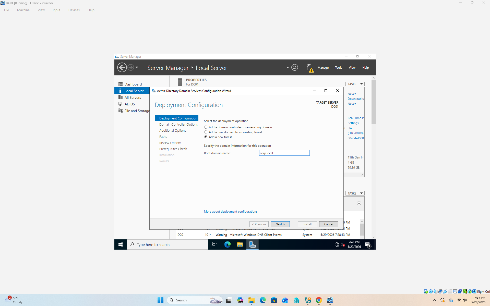 

# 2. Configured DNS
Configured DNS services automatically during AD DS installation.
Verified DNS resolution using: nslookup corp.local

 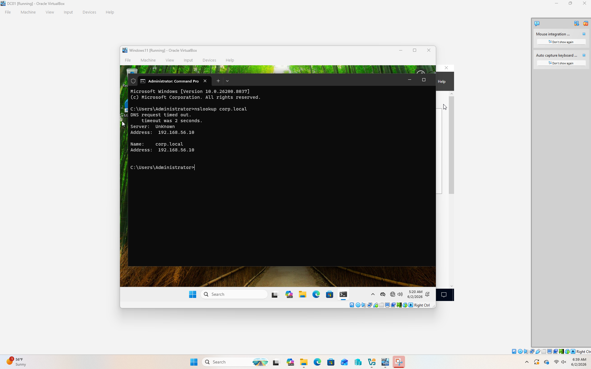 

# 3. Created 3 departmental Organizational Units (OUs)
Created department-based OUs:
- HR
- IT
- Sales
  
 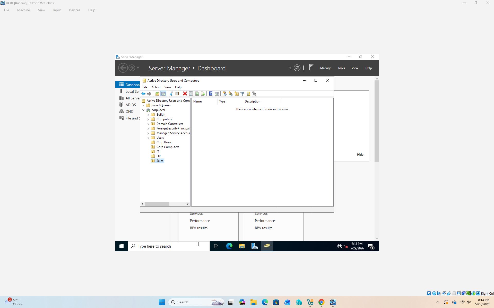 

# 4. Created Users accross multiple departments
Created test users including:
- Amelia Oliver
- Jarod Lee
- Sophia Lucas
- Olivia Noah
- Ali Adam

 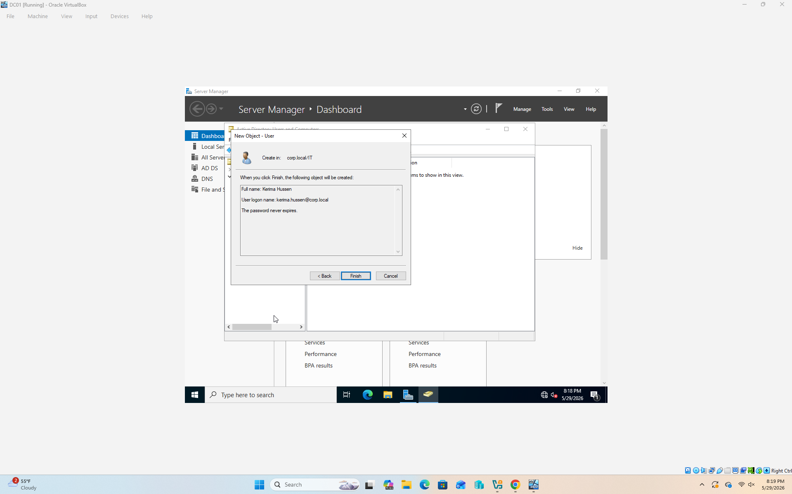 

# 5. Created Security Groups
Created:
IT_Admins
Assigned IT Admins to the group.

 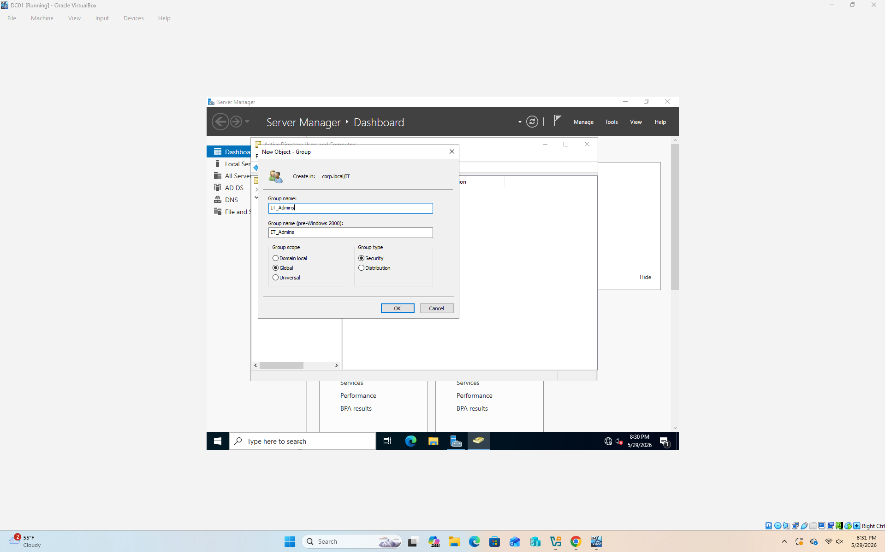 

# 6. Moved Users into OUs
Organized users into departmental OUs.

 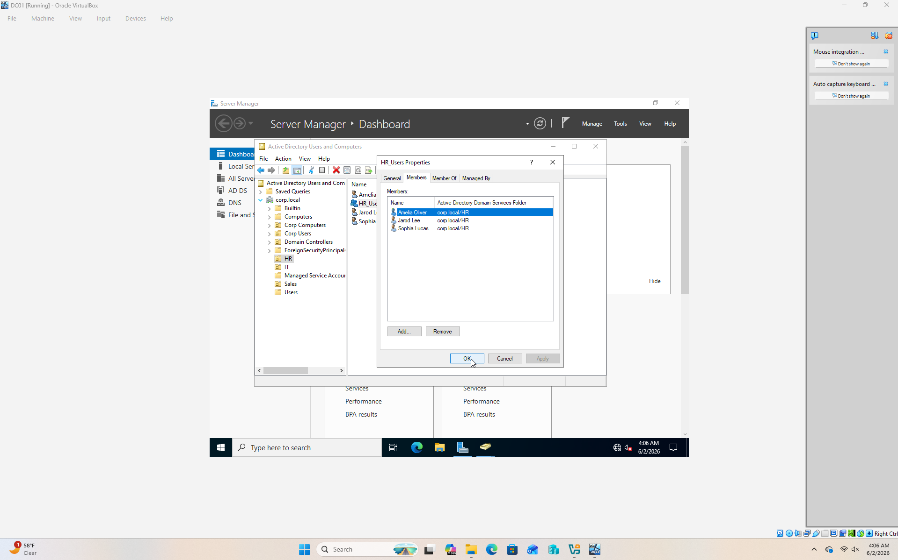 

# 7. Joined Windows 11 Workstation to Domain
Joined LAB-WIN11 to:
corp.local
Verified successful authentication.

  

# 8. Verified Network Connectivity
Verified communication between LAB-WIN11 and DC01.
Commands used:
- ipconfig /all
- ping 192.168.56.10
- nslookup corp.local
  
 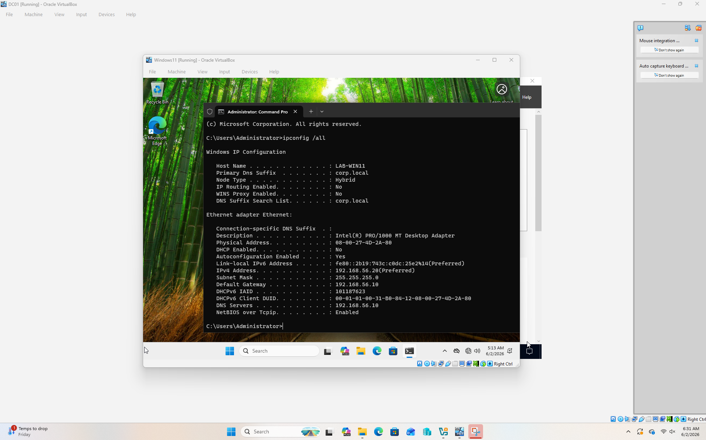 

# 9. Created Shared Folder
Created:
C:\Shares\HR
Shared as:
HR-Share

 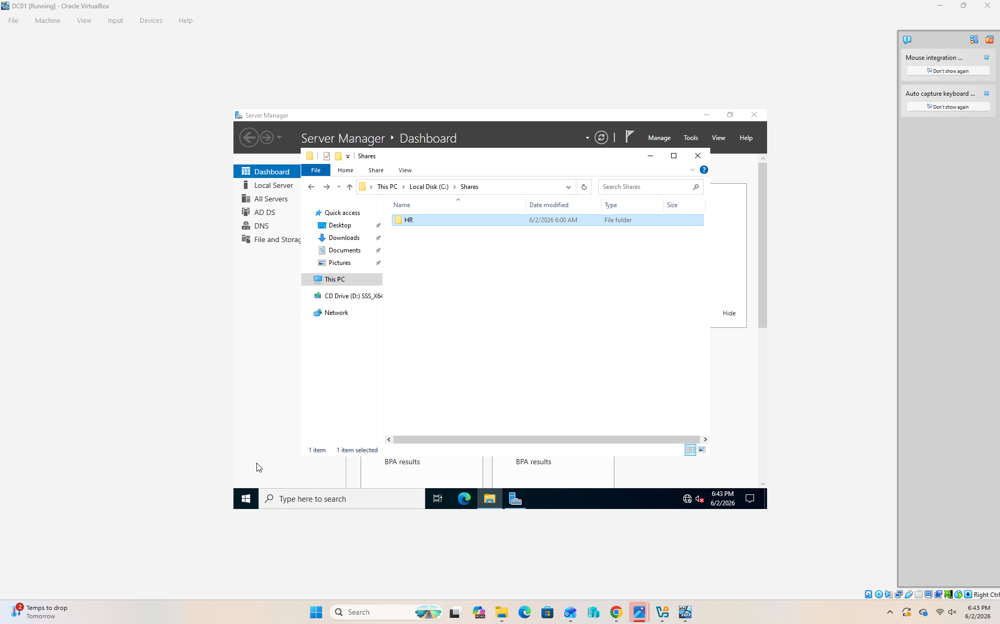 

# 10. Configured Share Permissions
Granted access to:
HR_Users
Permissions:
- Read
- Change
  
 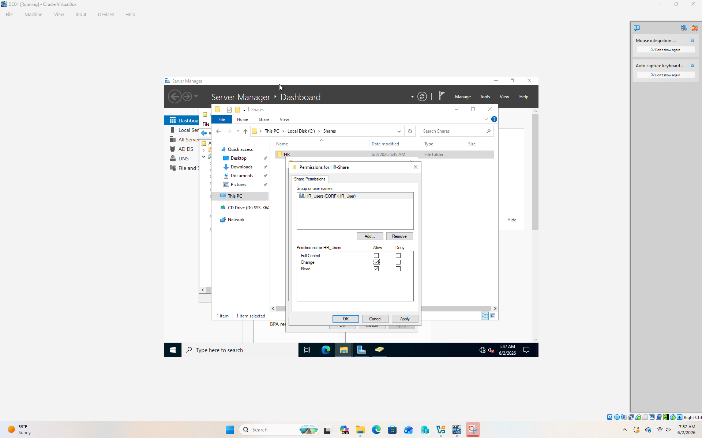 

# 11. Configured NTFS Permissions
Granted HR_Users:
- Modify
- Read
- Write
- Read & Execute
  
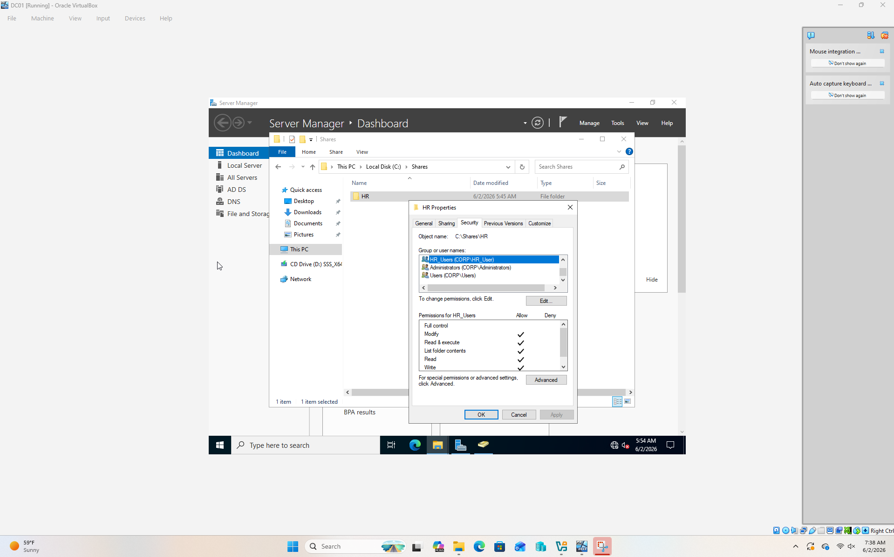 

# 12. Verified Access from Client Workstation
Logged into LAB-WIN11 as:
corp\olivia.noah
Accessed:
\\DC01\HR-Share
Created:
TestFile.txt
Successfully verified:
- Authentication
- Group Membership
- Share Permissions
- NTFS Permissions

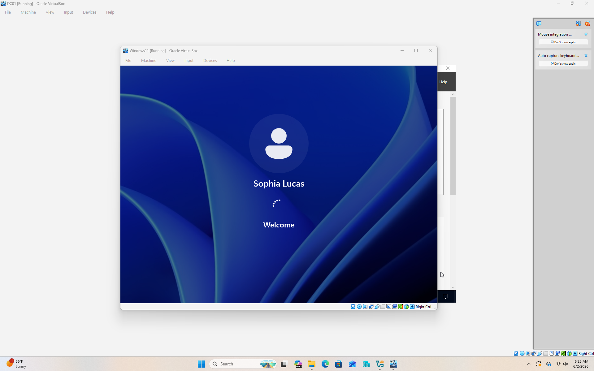 

# 13. Verified Domain Authentication 
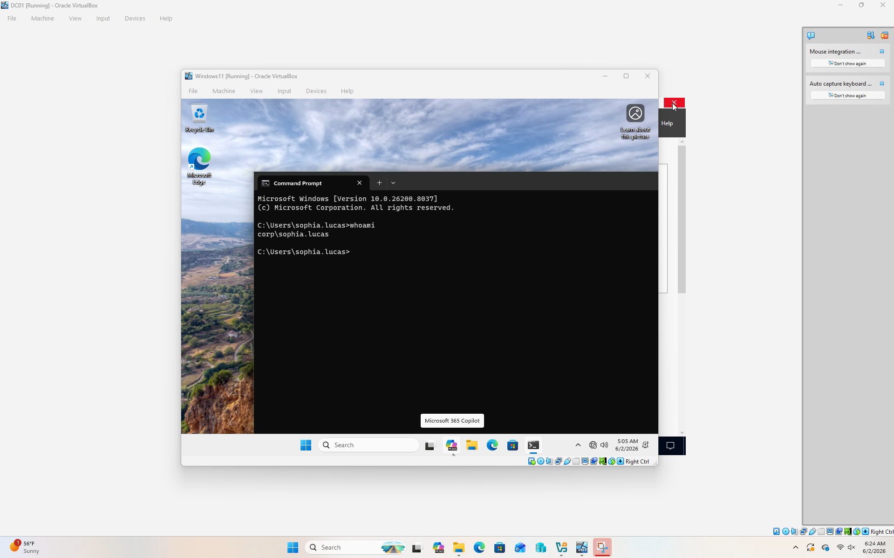 

# Project Outcome
Successfully built and managed a Windows Active Directory environment, joined a workstation to the domain, configured access controls, and verified secure access to shared resources using Active Directory security groups and NTFS permissions.
